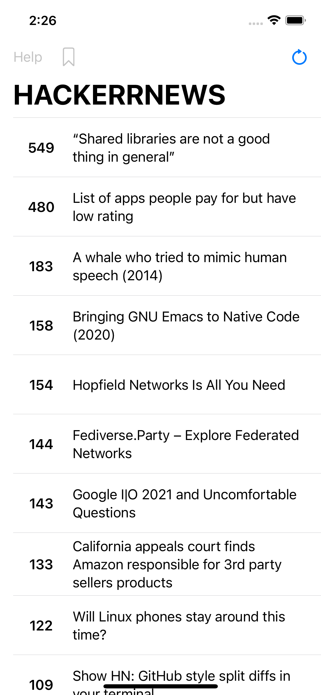

# HackerrNews
SwiftUI, a News app from Hacker News

# Menu
* [Screenshots](#screenshots)
* [To-Do](#to-do)
* [Source](#source)
* [Contributions](#contributions)
* [Contact](#contact)

# Screenshots

### To-Do
* Bookmark favorite articles

# Source
This news app is fully developed with SwiftUI.

### API

[Algolia](https://hn.algolia.com/api)

### Library

[SwiftyJSON](https://github.com/SwiftyJSON/SwiftyJSON)

[Alamofire](https://github.com/Alamofire/Alamofire)

# Contributions

* All kinds of contributions (enhancements, new features, documentation & code improvements, issues & bugs reporting & todo task) are welcome. Let's make it better.

# Contact
Created by [Terry Kuo](https://twitter.com/ArgonYoYo) - feel free to contact me!
